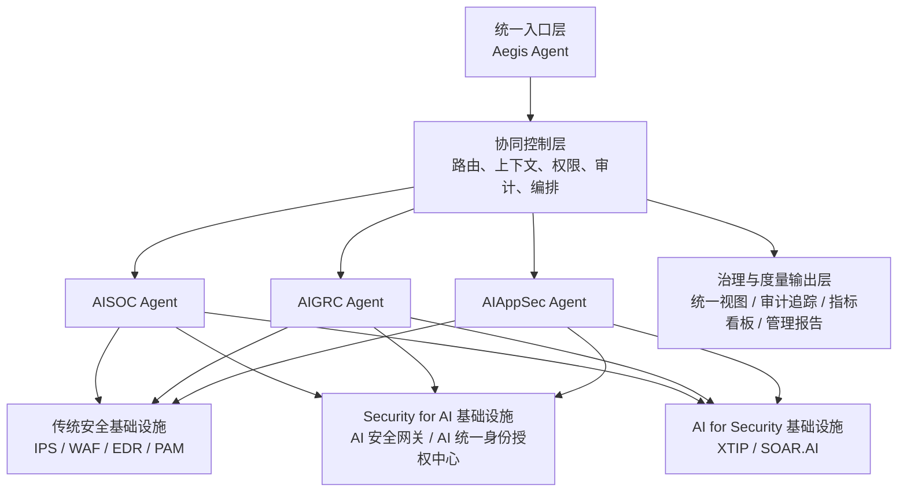
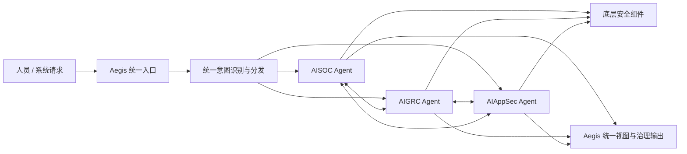

# Aegis 总体架构设计方案

## 1. 文档概述

### 1.1 文档目的

本文档用于定义 Aegis 的总体架构蓝图。Aegis 被定位为信息安全部门 AI 转型能力的统一入口与协同枢纽，用于统筹已有和持续建设中的安全 AI 能力、专业工作 Agent 以及底层安全基础设施，形成统一接入、统一分发、统一治理、统一视图的安全智能体系。

本文档面向领导和架构评审，重点说明：

- Aegis 的战略定位和建设价值
- Aegis 的分层架构和能力边界
- Aegis 与 AISOC Agent、AIGRC Agent、AIAppSec Agent 及底层安全组件的协同方式
- Aegis 的阶段性建设路径和演进方向

### 1.2 适用范围

本文档聚焦总体架构蓝图，不展开单个 Work Agent 的详细算法、接口字段或底层平台实现细节。

### 1.3 设计原则

- 统一入口，避免安全 AI 能力烟囱化
- 枢纽协同，不替代专业 Agent 的领域职责
- 充分复用现有安全基础设施与已有 Agent 能力
- 先治理可见，再深化协同，最后提升自动化深度
- 对人、对系统、对审计都保持一致的可追踪性

## 2. 背景与建设目标

随着信息安全部门在安全运营、合规内控、应用安全等领域逐步引入 AI 能力，当前体系开始呈现出以下特征：

- 多类安全 AI 能力已经部分存在，但入口分散
- 不同 Work Agent 能力独立建设，缺少统一协同视图
- 传统安全基础设施、Security for AI 基础设施、AI for Security 基础设施之间联动方式不统一
- 领导层需要统一观察安全 AI 建设成效，架构层需要统一管理边界、流程和治理要求

基于此，Aegis 的建设目标定义为：

- 成为安全部门 AI 能力的统一总入口
- 成为各类 Work Agent 的任务分发和协同起点
- 成为跨域安全能力与底层组件之间的统一治理层
- 成为面向领导、运营、治理角色的统一结果与度量出口

## 3. Aegis 定位

### 3.1 角色定义

Aegis 被定义为信息安全 AI 能力的总入口 Agent 和协同枢纽，而非替代所有专业 Agent 的超级执行 Agent。

它的核心职责是：

- 统一接收来自人员或系统的请求
- 对入口请求进行统一意图识别和任务分发
- 维护跨 Agent 的上下文承接和访问控制
- 汇总多 Agent 和多组件的处理结果
- 提供统一审计、统一状态跟踪和统一视图输出

### 3.2 非目标

Aegis 不承担以下职责：

- 不直接替代 AISOC、AIGRC、AIAppSec 的专业分析与专业判断
- 不直接取代 IPS、WAF、EDR、PAM 等既有安全基础设施
- 不以大一统平台方式重构所有现有安全系统
- 不在第一阶段追求高自治，而是优先保证治理、可见性和协同闭环

## 4. 总体架构

### 4.1 分层架构

Aegis 总体上采用五层架构：

1. 统一入口层
2. 协同控制层
3. Work Agent 层
4. 安全基础设施层
5. 治理与度量输出层

### 4.2 各层职责说明

#### 4.2.1 统一入口层

统一入口层由 Aegis Agent 承担，对外提供统一交互界面和统一任务入口。其核心能力包括：

- 面向人员和系统的统一接入
- 请求标准化和任务受理
- 统一会话管理
- 统一结果呈现

这一层重点解决的是“从哪里进入”和“最终由谁统一反馈”的问题。

#### 4.2.2 协同控制层

协同控制层是 Aegis 作为枢纽的关键能力层，负责：

- 意图识别与任务路由
- 上下文组装和跨 Agent 传递
- 权限校验与策略约束
- 工作流编排与状态跟踪
- 操作留痕与审计追踪

这一层重点解决的是“如何正确分发”和“如何可控协同”的问题。

#### 4.2.3 Work Agent 层

Work Agent 层由专业安全能力 Agent 构成，当前包括：

- AISOC Agent：负责安全运营、告警研判、调查分析、响应协同
- AIGRC Agent：负责合规内控、控制要求解释、证据关联、治理支撑
- AIAppSec Agent：负责应用安全、研发安全、暴露面分析、开发流程安全支撑

这一层重点解决的是“谁负责专业处理”的问题。

#### 4.2.4 安全基础设施层

安全基础设施层承载具体的检测、控制、审计、情报、自动化编排等执行能力，包括：

- 传统安全基础设施：IPS、WAF、EDR、PAM 等
- Security for AI 基础设施：AI 安全网关、AI 统一身份授权中心
- AI for Security 基础设施：XTIP、SOAR.AI

这一层重点解决的是“专业 Agent 调用什么能力完成动作”的问题。

#### 4.2.5 治理与度量输出层

治理与度量输出层面向领导、运营、治理等角色输出统一信息，包括：

- 统一任务与处置视图
- 跨域证据链与审计链
- 统一指标体系
- 管理驾驶舱和阶段性建设成效报告

这一层重点解决的是“如何统一观察和持续管理”的问题。

## 5. 能力边界

### 5.1 Aegis 的边界

Aegis 负责：

- 统一入口
- 统一意图识别
- 统一任务分发
- 统一上下文承接
- 统一状态编排
- 统一结果汇总
- 统一审计和治理输出

Aegis 不负责：

- 替代专业 Agent 进行深度领域决策
- 替代底层平台执行具体控制动作
- 在第一阶段统一改造所有基础设施接口

### 5.2 Work Agent 的边界

各 Work Agent 负责：

- 在本专业域内完成分析、判断和执行建议
- 调用本域所需工具、平台和知识资产
- 按标准工作流与其他 Work Agent 协作

各 Work Agent 不负责：

- 对外提供分散入口
- 取代 Aegis 的统一治理能力
- 绕开治理要求进行不可追踪协作

### 5.3 基础设施层的边界

基础设施层负责：

- 承载安全控制、数据获取、审计记录、自动化编排等底层能力

基础设施层不负责：

- 面向最终用户做统一交互
- 承担跨域业务语义的理解与任务编排

## 6. 协同模式设计

Aegis 采用双模式协同机制，以适配不同类型的安全工作场景。

### 6.1 模式一：统一入口模式

该模式适用于来自人员或外部系统的新请求。所有此类请求必须先进入 Aegis，由 Aegis 完成统一意图识别和任务分发。

处理流程如下：

1. 用户或系统向 Aegis 发起请求
2. Aegis 执行意图识别、上下文组装、权限校验和策略检查
3. Aegis 将任务路由至最合适的 Work Agent，或发起多 Agent 协同任务
4. Work Agent 调用相关安全组件完成分析、控制、取证或编排
5. Aegis 汇总结果并输出统一回答、工单动作、审计记录和视图更新

该模式的价值在于：

- 所有入口统一管理
- 用户体验统一
- 路由逻辑统一
- 结果出口统一

### 6.2 模式二：预定义协同模式

该模式适用于 Work Agent 进入既定业务流程之后的跨 Agent 协作场景。在此模式下，协作不再重复做意图识别，而是基于预定义工作流直接在 Work Agent 之间进行。

典型协作动作包括：

- 推送信息
- 获取信息
- 请求判断
- 推送决策
- 触发下一步动作

处理流程如下：

1. 某个 Work Agent 在处理过程中触发预定义工作流
2. 相关 Work Agent 按工作流规则进行协作
3. 各 Agent 继续调用本域安全基础设施完成验证、处置或取证
4. Aegis 不重复做入口意图识别，但负责状态治理、流程跟踪、策略约束和审计留痕
5. 工作流结果最终同步回 Aegis 的统一视图与度量层

该模式的价值在于：

- 提高跨域协同效率
- 避免重复识别和重复转发
- 保持工作流闭环的可治理性和可追踪性

### 6.3 协同模式关系

两种模式并不是互斥关系，而是分工明确的协同体系：

- 新请求通过 Aegis 统一受理，进入模式一
- 已进入工作流的任务在需要跨域联动时进入模式二
- 无论通过哪种模式，最终状态、结果、证据和度量均回流到 Aegis 统一管理

## 7. 典型协同场景

### 7.1 安全事件联动合规

- AISOC Agent 识别到安全事件
- 按预定义工作流触发 AIGRC Agent 评估控制影响、证据义务和治理要求
- Aegis 汇总事件处置和治理影响，形成统一输出

### 7.2 应用风险联动运营

- AIAppSec Agent 发现应用侧高风险暴露或缺陷
- 按预定义工作流请求 AISOC Agent 执行监测强化、告警关注或响应准备
- Aegis 汇总技术风险、运营动作和整改建议

### 7.3 AI 使用联动 AI 安全控制

- 用户通过 Aegis 发起与 AI 使用相关的请求
- Aegis 在统一入口模式下进行意图识别，并通过 AI 安全网关和 AI 统一身份授权中心实施访问与策略控制
- 相关 Work Agent 基于授权和策略结果继续处理

## 8. 治理设计要点

为保证 Aegis 作为枢纽的可控性和可信度，治理设计应重点覆盖以下方面：

- 统一身份与授权
- 统一审计留痕
- 统一工作流状态跟踪
- 统一证据归档与关联
- 统一指标与成效度量
- 人工干预和审批机制保留

治理重点不是削弱 Agent 自主性，而是在安全部门 AI 转型过程中，确保协同过程始终处于可理解、可解释、可追踪、可管理状态。

## 9. 建设路线

### 9.1 第一阶段：近期建设

目标：建立 Aegis 统一入口和基础可见性。

重点建设项：

- 建立 Aegis 统一接入能力
- 接入现有 AISOC、AIGRC、AIAppSec Agent
- 打通基础任务路由、权限控制、审计记录和结果汇总
- 建立面向运营和管理的初步统一视图

阶段产出：

- 可用的统一入口
- 可见的任务分发链路
- 基础治理能力
- 初始跨域管理看板

### 9.2 第二阶段：中期建设

目标：形成稳定的多 Agent 协同闭环。

重点建设项：

- 标准化 Work Agent 间的预定义协同工作流
- 增强与传统安全基础设施和 AI 安全组件的联动
- 建立证据共享、跨域触发和流程模板能力
- 形成面向不同角色的多层次视图

阶段产出：

- 稳定的 Agent 间协同机制
- 更高的流程复用性
- 更完整的跨域闭环
- 可量化的安全运营与治理成效

### 9.3 第三阶段：远期建设

目标：将 Aegis 演进为企业级安全 AI 能力中枢。

重点建设项：

- 基于策略、指标和反馈持续优化协同效果
- 覆盖更多安全域和更多 AI 原生安全服务
- 在治理可控前提下提升自动化深度
- 将 Aegis 打造成安全 AI 转型的统一运营界面

阶段产出：

- 可扩展的安全 AI 能力网络
- 更高层级的自动化协同能力
- 更清晰的组织价值呈现

## 10. 方案价值

从管理视角看，Aegis 的价值在于：

- 将分散建设的安全 AI 能力整合为统一能力体系
- 提升领导对安全 AI 建设成效的观察和管理能力
- 降低跨域流程割裂带来的协同成本

从架构视角看，Aegis 的价值在于：

- 在不推翻现有能力的前提下建立统一入口和协同框架
- 清晰划分入口、协同、专业处理与基础设施之间的边界
- 为后续扩展更多 Agent 和更多安全组件预留稳定架构位点

## 11. 风险与控制要点

在推进过程中，需要重点关注以下风险：

- Aegis 定位不清，演变为重复建设的超级平台
- Work Agent 间接口和工作流不标准，导致协同难以复制
- 底层能力接入不一致，影响统一视图和统一度量
- 自动化推进过快，快于治理能力成熟度

对应控制要点包括：

- 始终坚持 Aegis 作为枢纽而非替代者的角色定义
- 优先标准化工作流、证据模型和审计要求
- 坚持阶段性建设，先入口和治理，后深度自动化

## 12. 结论

Aegis 的核心意义，不在于再建设一个新的安全工具，而在于将信息安全部门已经存在和即将建设的 AI 能力，组织成一个统一入口、统一协同、统一治理、统一视图的能力体系。

在该架构下：

- Aegis 负责统一入口与协同枢纽
- Work Agent 负责专业域能力执行
- 安全基础设施负责具体控制与执行支撑
- 治理与度量层负责组织级观察和持续优化

该方案既适合当前已有能力部分存在的现实基础，也为后续安全 AI 能力规模化建设提供了清晰、可演进、可治理的总体框架。
