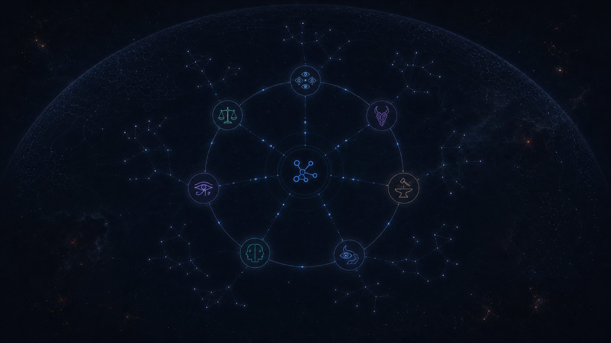
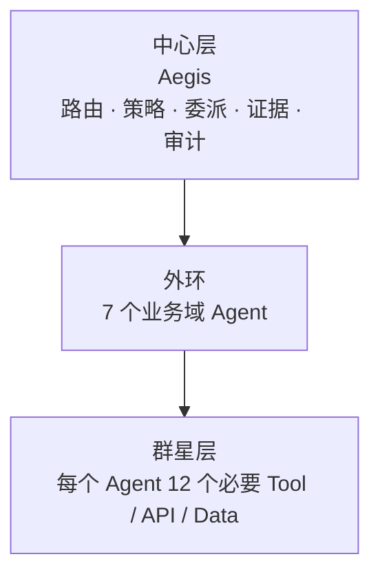

# Aegis 三层编排星图说明

## 目标

[`../aegis_starmapping.json`](../aegis_starmapping.json) 是 **Aegis Orchestration Topology** 的唯一设计数据源。它替换原总览页面中写死的旧 Agent/VIP Tool 演示数据，为拓扑渲染、`GET /api/overview/topology` 与运行态适配提供稳定契约。

本次只建立数据基线，不把 84 个支撑节点重新硬编码进前端组件。当前 `OverviewTab.tsx` 仍是旧的演示渲染，后续实现必须消费该 JSON（或由它生成的后端 API 响应）。

## 视觉效果参考图



该图为 2048 × 1152 的视觉方向稿：适度放大的 Aegis 连接符核心作为视觉锚点；七个业务域 Agent 环绕互联；每个 Agent 对应一个低亮度群星簇，细粒度能量流从群星汇入 Agent，再连接至核心。七个星环节点以多眼（Argus）、天秤（Themis）、北欧结/面具（Loki）、铁砧（Vulcan）、守望之眼（Heimdall）、双面（Janus）和荷鲁斯之眼（Wedjat）区分，深色星空中若隐若现的全幅数字化护盾由星环与群星共同构成，表达在危险与未知环境中覆盖全区的守护。图中没有文字标签，正式产品实现应从 JSON 读取真实名称、能力和运行状态。

## 前端视觉素材

`frontend/src/assets/starmapping/` 提供可直接用于运行时星图的素材，而非把视觉符号重新硬编码在组件中：

- `starmapping-starfield-background.png`：从 V3 意境图中移除 Aegis、7 个星环和相应连线后生成的 2048 × 1152 群星背景；保留暗色星云、散点群星与隐约数字化护盾。
- `aegis-connection.svg`：Aegis 的简约连接符核心。
- `argus-eyes.svg`、`themis-scales.svg`、`loki-knot.svg`、`vulcan-anvil.svg`、`heimdall-eye.svg`、`janus-duality.svg`、`wedjat-eye.svg`：7 个 Agent 的独立神话符号，颜色与其星环一致。

`StarmappingTopology.tsx` 以背景图铺陈星空，以 SVG 作为中心和星环节点的图标；中心至星环始终存在低亮度流光，命中节点后其完整路径会提升亮度并增加流光。群星节点采用按稳定 ID 派生的错峰闪耀时间，视觉上呈现随机星闪而不会在每次渲染时跳变。

## 三层模型



| 层级 | 内容 | 责任边界 |
| --- | --- | --- |
| 中心 | Aegis | 统一意图路由、策略执行、跨域委派、证据汇聚、风险优先级与审计。它不直接替代业务域专业判断。 |
| 外环 | 7 个 Agent | 将中心下达的目标转化为业务域工作流，只依赖各自明确归属的群星能力。 |
| 群星 | Tool、API、Data | 提供实际查询、分析、执行或证据。每个节点有 `kind`、接入方式和业务用途，避免“工具名称占位符”。 |

## 外环 Agent 定义

| 业务域 | Agent | 文化来源 | 业务内涵契合点 |
| --- | --- | --- | --- |
| AI-SOC | [ Argus ] | 希腊神话·百眼巨人 | 全天候、零死角威胁监控与感知 |
| AI-GRC | [ Themis ] | 希腊神话·正义与秩序女神 | 合规、合理、秩序与法则 |
| AI-REDTEAM | [ Loki ] | 北欧神话·恶作剧与变幻之神 | 模拟实战攻击、出其不意、突破防御 |
| AI-SDLC | [ Vulcan ] | 罗马神话·工匠与锻造之神 | 源头铸造、安全开发与软件工程 |
| AI-UEBA | [ Heimdall ] | 北欧神话·极目神/守护神 | 敏锐洞察细微行为异常、防潜入 |
| AI-ITOps | [ Janus ] | 罗马神话·双面与门户之神 | 观前顾后、确保系统通达与平稳运转 |
| AI-Web3 | [ Wedjat ] | 古埃及神话·荷鲁斯之眼 | 完整性、去中心化信任与圣物防护 |

`Themis` 与 `Wedjat` 作为已有命名被保留；其余命名按本次星图统一。

## 群星数据要求

JSON 为每个 Agent 列出 12 个必须能力，合计 84 个群星节点。每个节点都包含：

- `id`：稳定、全局唯一的机器标识；前缀对应所属 Agent。
- `kind`：只能是 `tool`、`api` 或 `data`。
- `integration`：可对接的逻辑接口与常见系统示例，而非绑定单一厂商。
- `purpose`：说明它为何是该 Agent 的必要能力。
- `required`：当前基线均为 `true`。部署可因环境能力暂不可用，但不能无声明地移除其职责。

AI-REDTEAM 的所有群星能力须受 `loki-roe`（授权范围与交战规则）约束；攻击模拟、扫描或验证只能在已批准的目标与时间窗内执行。

## 数据契约与后续实现

### 静态设计数据

`aegis_starmapping.json` 中的关键结构：

```text
center                         # Aegis 中心节点
agent_ring[]                   # 7 个 Agent
agent_ring[].star_nodes[]      # 该 Agent 的 Tool / API / Data 群星
relationships.center_to_agents # Aegis -> Agent 编排边
validation                     # 数量、类型和必填字段约束
```

群星到 Agent 的 `requires` 边由其嵌套归属隐式表达。这使数据更易维护，也避免把每个节点的 `parent_agent_id` 重复写入。若 API 需要扁平图结构，可在服务端输出时展开为：

```json
{
  "source": "ai-soc",
  "target": "argus-siem",
  "mode": "requires"
}
```

### 运行态覆盖

静态文件定义“应有什么”，运行态定义“现在是否可用”。后端 `GET /api/v1/topology` 应在不改变身份字段的前提下，为每个节点添加例如：

```json
{
  "enabled": true,
  "health": "healthy",
  "last_seen_at": "2026-07-24T08:00:00Z",
  "task_count": 18,
  "last_result": "success"
}
```

不要将这些瞬态字段回写到设计基线 JSON。

### 前端渲染建议

1. 默认只显示中心层和 7 个外环 Agent；采用 `agent_ring[].layout.angle_degrees` 均匀定位外环。
2. 选中 Agent 后，展开它的 12 个群星节点，或在右侧面板按 `kind` 分组展示；不要默认同时渲染全部 84 个标签。
3. 选中群星节点时，高亮 `Aegis → Agent → 群星` 的完整路径，并显示 `integration`、`purpose` 与运行态。
4. 图例使用三类群星：Tool（执行）、API（访问接口）、Data（情报与证据）。不要继续使用含义不清的 “VIP Tool” 分类。
5. 后端 API 采用 JSON 作为静态基线，再叠加实际配置和健康检查；前端不再维护第二份拓扑常量。

## 校验规则

- 必须恰好有一个中心节点 `aegis`。
- 外环必须恰好有 7 个 Agent，且其 `id`、命名和业务域唯一。
- 每个 Agent 必须有 10–20 个、当前基线为 12 个群星节点。
- 群星节点全局 ID 唯一，且 `kind`、`integration`、`purpose`、`required` 不得缺失。
- 中心到外环必须有 7 条 `orchestrates` 边；外环到群星由嵌套关系展开为 `requires` 边。
